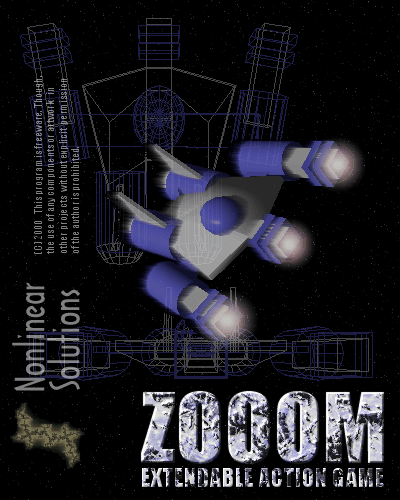



## ZOOOM \- Extendable Arcarde Shooter

### Description

ZOOOM is an extendable action game that features all-rendered graphics, sound effects, music, midgame video, joystick support, two multilevel campaigns and more. You can use the built-in scripting language to customize levels. HTML style help is provided. Have fun!
 
### More Info
 

             |
---                |---
**Submitted On**   |2000-10-29 15:01:30
**By**             |[Wolfgang Kienreich](https://github.com/Planet-Source-Code/PSCIndex/blob/master/ByAuthor/wolfgang-kienreich.md)
**Level**          |Advanced
**User Rating**    |4.3 (56 globes from 13 users)
**Compatibility**  |VB 6\.0
**Category**       |[Games](https://github.com/Planet-Source-Code/PSCIndex/blob/master/ByCategory/games__1-38.md)
**World**          |[Visual Basic](https://github.com/Planet-Source-Code/PSCIndex/blob/master/ByWorld/visual-basic.md)
**Archive File**   |[CODE\_UPLOAD112361122000\.zip](https://github.com/Planet-Source-Code/wolfgang-kienreich-zooom-extendable-arcarde-shooter__1-12375/archive/master.zip)

